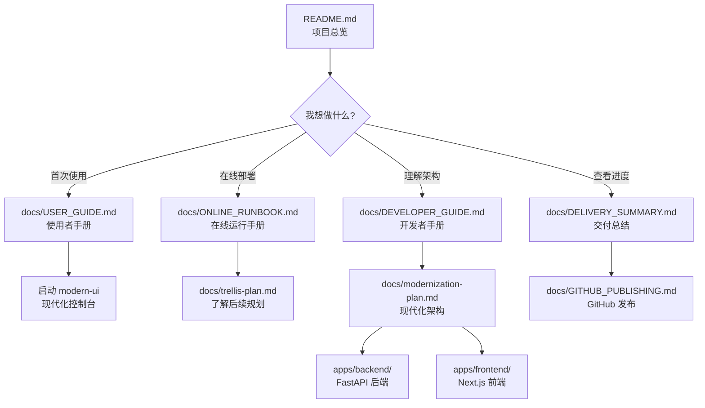

# 文档导航地图

更新时间：2026-06-04

本文档是整个项目的文档导航中心，帮助你快速找到需要的信息。

## 快速导航表

| 我想... | 看这个文档 | 预计时间 |
|---------|-----------|---------|
| 快速了解项目能做什么 | [README.md](README.md) | 3 分钟 |
| 第一次安装和运行 | [docs/USER_GUIDE.md](docs/USER_GUIDE.md) | 15 分钟 |
| 接入真实 LLM 和 Tushare | [docs/ONLINE_RUNBOOK.md](docs/ONLINE_RUNBOOK.md) | 20 分钟 |
| 理解系统架构和模块 | [docs/DEVELOPER_GUIDE.md](docs/DEVELOPER_GUIDE.md) | 30 分钟 |
| 了解当前开发进度 | [docs/DELIVERY_SUMMARY.md](docs/DELIVERY_SUMMARY.md) | 10 分钟 |
| 查看现代化重构路线 | [docs/modernization-plan.md](docs/modernization-plan.md) | 15 分钟 |
| 了解未来规划 | [docs/trellis-plan.md](docs/trellis-plan.md) | 10 分钟 |
| 发布到 GitHub | [docs/GITHUB_PUBLISHING.md](docs/GITHUB_PUBLISHING.md) | 10 分钟 |

## 按角色导航

### 我是使用者

**推荐阅读顺序**：

1. [README.md](README.md) - 快速了解项目
2. [docs/USER_GUIDE.md](docs/USER_GUIDE.md) - 从安装到运行的完整指南
3. [docs/ONLINE_RUNBOOK.md](docs/ONLINE_RUNBOOK.md) - 接入在线服务（LLM 和 Tushare）
4. [docs/DELIVERY_SUMMARY.md](docs/DELIVERY_SUMMARY.md) - 查看当前可用功能

**关键命令**：
```powershell
.\start.bat -Mode status                    # 检查环境
.\start.bat -Mode offline -MaxCount 1       # 离线体验
.\start.bat -Mode modern-ui -Port 3000      # 启动现代控制台
```

### 我是开发者

**推荐阅读顺序**：

1. [README.md](README.md) - 项目总览
2. [docs/DEVELOPER_GUIDE.md](docs/DEVELOPER_GUIDE.md) - 架构、模块边界、开发约定
3. [docs/modernization-plan.md](docs/modernization-plan.md) - 现代化重构架构（Tauri/Next.js/FastAPI）
4. [docs/trellis-plan.md](docs/trellis-plan.md) - 持久化开发计划和后续方向
5. [docs/DELIVERY_SUMMARY.md](docs/DELIVERY_SUMMARY.md) - 当前交付状态和验证结果

**关键命令**：
```powershell
python -m pytest                            # 运行测试
npm --prefix apps/frontend run lint         # 前端 lint
python -m mkdocs build --strict             # 构建文档站
```

### 我是核心开发者（技术深入）

**推荐阅读顺序**：

1. [docs/technical/ARCHITECTURE.md](docs/technical/ARCHITECTURE.md) - 系统架构：8 Agent协作、单LLM vs 多LLM、数据流
2. [docs/technical/FLOWS.md](docs/technical/FLOWS.md) - 流程与时序：启动流程、自动投资流程、用户视角 vs Agent视角
3. [docs/technical/DESIGN_DECISIONS.md](docs/technical/DESIGN_DECISIONS.md) - 设计决策：UI框架选型、透明化实现、配置热加载
4. [docs/technical/COMPARISON.md](docs/technical/COMPARISON.md) - 同类项目对比：FinRL、AutoGPT、LangChain、Qlib
5. [docs/technical/USER_NEEDS_MAPPING.md](docs/technical/USER_NEEDS_MAPPING.md) - 需求映射：用户场景 → 功能设计 → 代码位置

**这些文档回答**：
- 为什么这么设计（UI框架、Agent架构、单LLM vs 多LLM）
- 怎么实现的（系统架构图、时序图、数据流）
- 和同类项目比有什么优劣（FinRL、AutoGPT等）
- 用户操作如何映射到代码（快速定位代码位置）

### 我是运维人员

**推荐阅读顺序**：

1. [docs/ONLINE_RUNBOOK.md](docs/ONLINE_RUNBOOK.md) - 在线部署手册
2. [docs/GITHUB_PUBLISHING.md](docs/GITHUB_PUBLISHING.md) - GitHub 发布流程
3. [docs/DELIVERY_SUMMARY.md](docs/DELIVERY_SUMMARY.md) - 质量门禁和验证命令

## 按场景导航

### 场景 1：首次接触项目

```
[README.md] 
    ↓ 3 分钟了解项目
[docs/USER_GUIDE.md]
    ↓ 15 分钟完成安装和离线运行
[docs/DELIVERY_SUMMARY.md]
    ↓ 10 分钟查看当前可用功能
```

### 场景 2：准备在线部署

```
[docs/ONLINE_RUNBOOK.md]
    ↓ 配置 Tushare Token 和 LLM API Key
[启动 bench 测试]
    ↓ 验证 LLM 模型可用性
[启动在线自动投资]
    ↓ 运行首次在线轮次
[docs/DELIVERY_SUMMARY.md]
    ↓ 检查验证状态
```

### 场景 3：理解系统架构

```
[docs/technical/ARCHITECTURE.md]
    ↓ 系统架构图、8 Agent协作图、数据流图
[docs/technical/FLOWS.md]
    ↓ 启动流程时序图、自动投资流程图
[docs/technical/DESIGN_DECISIONS.md]
    ↓ 为什么选这个UI框架、透明化怎么实现
[docs/DEVELOPER_GUIDE.md]
    ↓ 模块边界、测试、开发约定
[apps/backend/app.py]
    ↓ 查看 FastAPI 后端实现
[apps/frontend/src/components/trading-dashboard.tsx]
    ↓ 查看 Next.js 前端实现
```

### 场景 4：参与开发

```
[docs/DEVELOPER_GUIDE.md]
    ↓ 了解开发规范
[docs/trellis-plan.md]
    ↓ 查看后续规划和待做任务
[.cursor/skills/astock-delivery-workflow/SKILL.md]
    ↓ 了解交付工作流
[运行测试和验证]
    ↓ 确保代码质量
```

## 文档关系图



## 历史文档说明

以下文档是项目早期规划，当前已被 `docs/` 目录下的文档替代：

| 历史文档 | 当前对应文档 | 说明 |
|---------|-------------|------|
| `PROJECT_PLAN.md` | [docs/trellis-plan.md](docs/trellis-plan.md) + [docs/modernization-plan.md](docs/modernization-plan.md) | 早期完整规划（78KB），当前已拆分成持久化计划和重构计划 |
| `QUESTIONS_FOR_CONFIRMATION.md` | 已实现 | 8个决策问题已在开发中回答并实现 |
| `PROGRESS_REPORT.md` | [docs/DELIVERY_SUMMARY.md](docs/DELIVERY_SUMMARY.md) | 早期进度报告，当前用交付总结替代 |

**建议**：如果你是第一次阅读，直接看 `docs/` 目录下的文档即可，无需查看历史文档。

## 文档时间线

### 2026-06-01（项目初期）
- `PROJECT_PLAN.md` - 初始项目规划
- `QUESTIONS_FOR_CONFIRMATION.md` - 8个关键决策问题

### 2026-06-03（重构开始）
- `docs/trellis-plan.md` - 持久化开发计划
- `docs/modernization-plan.md` - 现代化重构计划
- `docs/DELIVERY_SUMMARY.md` - 交付总结
- `docs/USER_GUIDE.md` - 使用者手册
- `docs/DEVELOPER_GUIDE.md` - 开发者手册
- `docs/ONLINE_RUNBOOK.md` - 在线运行手册

### 2026-06-04（当前）
- **最新文档**：`docs/` 目录下的所有文档
- **最新进度**：[docs/DELIVERY_SUMMARY.md](docs/DELIVERY_SUMMARY.md)
- **最新架构**：[docs/modernization-plan.md](docs/modernization-plan.md)

## 文档更新频率

| 文档类型 | 更新频率 | 说明 |
|---------|---------|------|
| `docs/DELIVERY_SUMMARY.md` | 每次交付后 | 反映最新可用功能和验证状态 |
| `docs/trellis-plan.md` | 每个迭代后 | 更新已完成任务和后续规划 |
| `docs/modernization-plan.md` | 架构变更时 | 更新技术决策和接口边界 |
| `docs/USER_GUIDE.md` | 功能变更时 | 更新使用说明和命令示例 |
| `docs/DEVELOPER_GUIDE.md` | 模块变更时 | 更新架构说明和开发约定 |

## 如何使用这份导航

1. **如果你是第一次接触项目**
   - 从"按角色导航"找到你的角色
   - 按推荐顺序阅读文档
   - 边看边试验，使用"关键命令"验证

2. **如果你要完成特定任务**
   - 从"快速导航表"找到对应场景
   - 点击文档链接直接跳转
   - 查看"预计时间"安排阅读

3. **如果你想深入理解**
   - 查看"文档关系图"理解文档之间的依赖
   - 按"文档时间线"了解项目演进
   - 阅读"历史文档"了解决策背景（可选）

4. **如果你不确定看哪个**
   - 优先看 [README.md](README.md)
   - 再看 [docs/DELIVERY_SUMMARY.md](docs/DELIVERY_SUMMARY.md)
   - 根据需要深入其他文档

## 常见问题

### Q: 文档太多，我应该全部看完吗？

**A**: 不需要。按角色和场景选择性阅读即可：
- 使用者只需看 `USER_GUIDE.md` 和 `ONLINE_RUNBOOK.md`
- 开发者重点看 `DEVELOPER_GUIDE.md` 和 `modernization-plan.md`
- 历史文档（根目录的 `PROJECT_PLAN.md` 等）可以跳过

### Q: 我想快速了解项目当前状态？

**A**: 直接看这两个文档：
1. [docs/DELIVERY_SUMMARY.md](docs/DELIVERY_SUMMARY.md) - 当前可用功能
2. [docs/trellis-plan.md](docs/trellis-plan.md) - 后续规划

### Q: 我想贡献代码，应该看哪些文档？

**A**: 按这个顺序：
1. [docs/DEVELOPER_GUIDE.md](docs/DEVELOPER_GUIDE.md) - 开发规范
2. [docs/trellis-plan.md](docs/trellis-plan.md) - 待做任务
3. [.cursor/skills/astock-delivery-workflow/SKILL.md](.cursor/skills/astock-delivery-workflow/SKILL.md) - 交付规范

### Q: 某个文档看不懂怎么办？

**A**: 检查是否遗漏了前置文档：
- 查看"文档关系图"找到前置依赖
- 先阅读箭头指向的上游文档
- 如果还不清楚，从 `README.md` 重新开始

## 反馈和改进

如果你发现：
- 文档导航不够清晰
- 某个场景缺少对应文档
- 文档之间的关系描述有误
- 文档更新不及时

请在项目中提出 Issue 或直接更新本文档。

---

**提示**：本文档会随着项目演进持续更新，请定期查看"文档时间线"章节了解最新变化。
