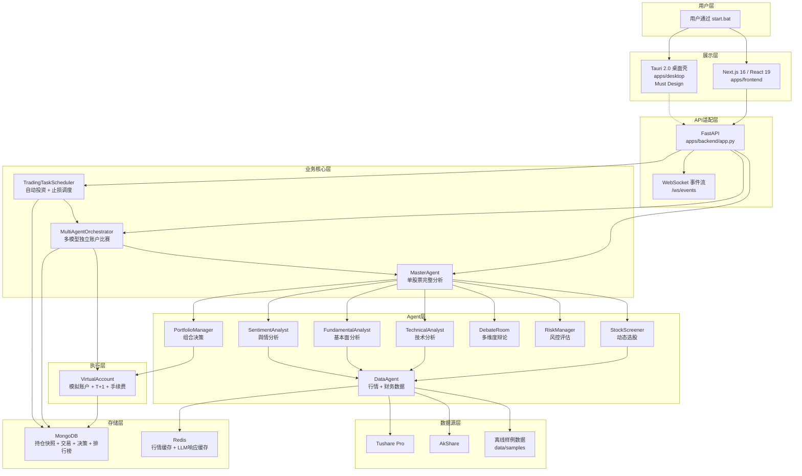
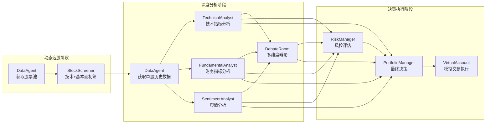
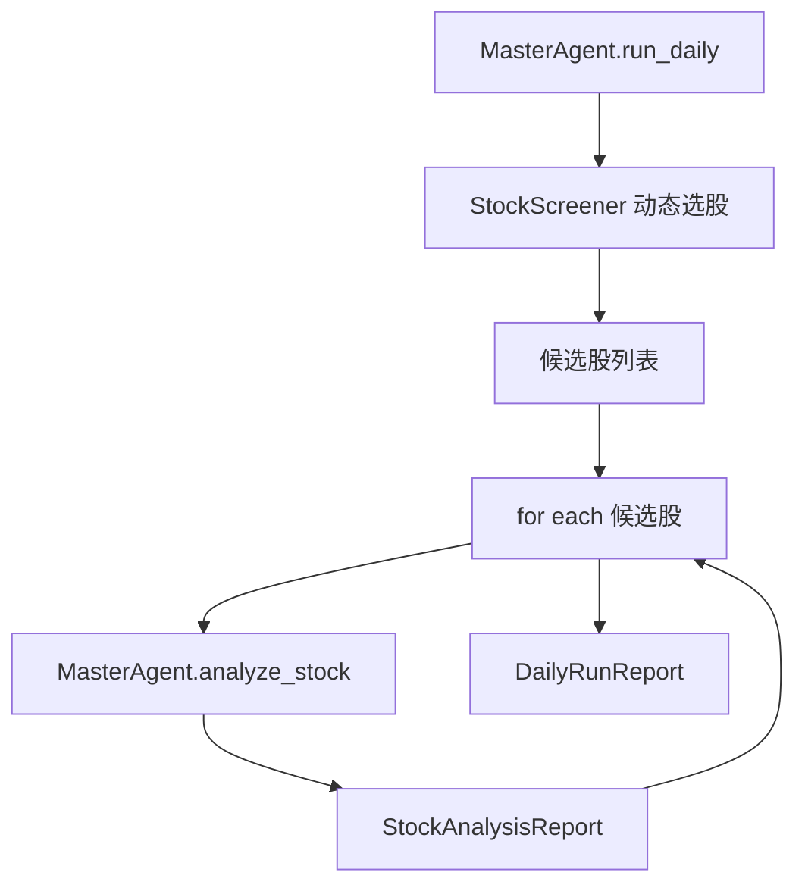
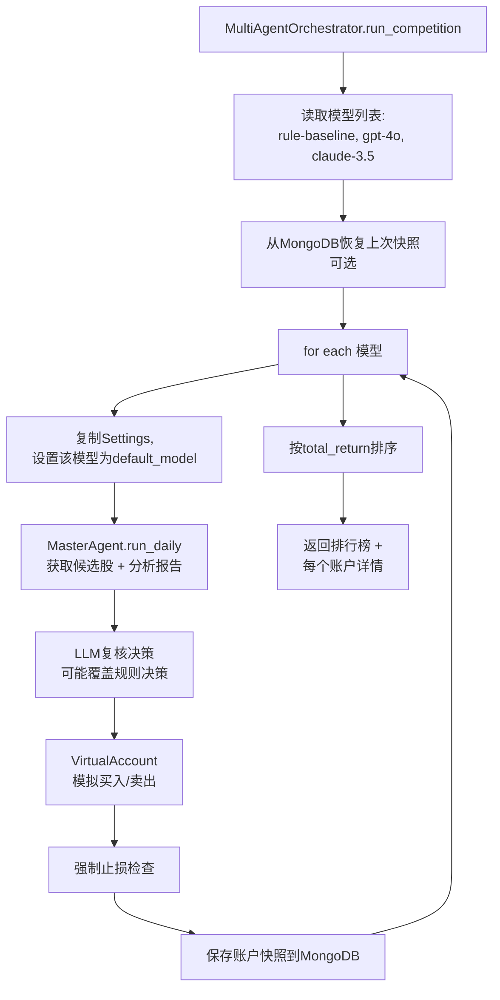
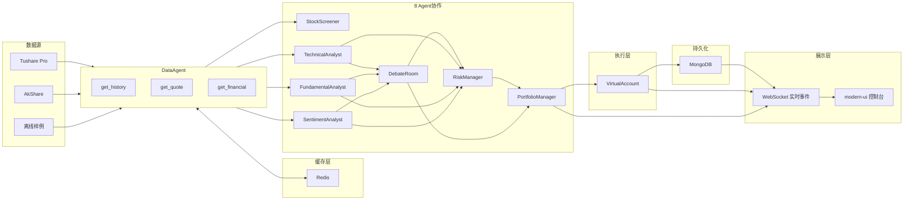

# 系统架构文档

更新时间：2026-06-05

本文档面向核心开发者，描述系统的整体架构、Agent协作方式、数据流和关键设计决策。

---

## 1. 系统整体架构

### 1.1 技术栈分层



### 1.2 架构分层说明

| 层次 | 职责 | 技术选择 |
|------|------|---------|
| **用户层** | 小白一键启动 | `start.bat` / `start.ps1` |
| **展示层** | 现代化UI + 实时透明 | Next.js 16 + React 19 + Tailwind + Shadcn + React Flow + Recharts |
| **API适配层** | 后端适配 + WebSocket事件流 | FastAPI + WebSocket |
| **业务核心层** | 投资决策 + 多模型比赛 + 自动调度 | MasterAgent + MultiAgentOrchestrator + TradingTaskScheduler |
| **Agent层** | 8个专业Agent分工协作 | DataAgent, StockScreener, 5个分析Agent, DebateRoom, RiskManager, PortfolioManager |
| **执行层** | 模拟盘严格验证 | VirtualAccount (T+1, 手续费, 滑点, 止损) |
| **存储层** | 持久化 + 缓存 | MongoDB + Redis |
| **数据源层** | 行情 + 财务 + 舆情 | Tushare / AkShare / 离线样例 |

---

## 2. 8 Agent 协作架构

### 2.1 Agent协作流程图



### 2.2 Agent职责表

| Agent | 职责 | 输入 | 输出 | 代码位置 |
|-------|------|------|------|---------|
| **DataAgent** | 行情、财务、舆情数据获取，支持Tushare/AkShare/离线降级 | stock_code, days | 历史K线、财务报表、实时报价 | `src/astock_agent_system/data/data_agent.py` |
| **StockScreener** | 动态选股，不依赖固定股票池 | max_count, history_days | 候选股票列表 + 初筛得分 | `src/astock_agent_system/agents/screener.py` |
| **TechnicalAnalyst** | 技术指标分析（趋势、震荡、成交量） | stock_code, 历史K线 | 技术评分 + 买卖信号 | `src/astock_agent_system/agents/technical_analyst.py` |
| **FundamentalAnalyst** | 基本面分析（估值、盈利、成长性） | 财务报表 | 基本面评分 + 投资价值 | `src/astock_agent_system/agents/fundamental_analyst.py` |
| **SentimentAnalyst** | 舆情分析（行业热度、新闻情绪） | stock_code, stock_name, sector | 舆情评分 + 市场情绪 | `src/astock_agent_system/agents/sentiment_analyst.py` |
| **DebateRoom** | 多维度辩论，综合技术/基本面/舆情 | technical, fundamental, sentiment | 综合研判 + 分歧度 | `src/astock_agent_system/agents/debate_room.py` |
| **RiskManager** | 风控评估，强制拒绝高风险标的 | 报价 + 技术 + 基本面 + 舆情 + 当前仓位 | 风险评分 + 是否拒绝 | `src/astock_agent_system/agents/risk_manager.py` |
| **PortfolioManager** | 最终决策：BUY/HOLD/SELL + 仓位 | 所有上游分析 | 动作 + 仓位比例 + 理由 | `src/astock_agent_system/agents/portfolio_manager.py` |

### 2.3 MasterAgent：单股票完整分析编排

`MasterAgent` 负责对**单只股票**进行完整的8 Agent协作分析，输出 `StockAnalysisReport`。

核心方法：
```python
# src/astock_agent_system/agents/master_agent.py

def analyze_stock(self, stock_code: str, history_days: int = 24) -> StockAnalysisReport:
    # 1. 获取数据
    bars = self.data_agent.get_history(stock_code, days=history_days)
    quote = self.data_agent.get_quote(stock_code)
    financial = self.data_agent.get_financial(stock_code)
    
    # 2. 并行分析
    technical = self.technical_analyst.analyze(stock_code, bars)
    fundamental = self.fundamental_analyst.analyze(financial)
    sentiment = self.sentiment_analyst.analyze(stock_code, ...)
    
    # 3. 综合研判
    debate = self.debate_room.analyze(stock_code, technical, fundamental, sentiment)
    
    # 4. 风控评估
    risk = self.risk_manager.analyze(stock_code, quote, technical, fundamental, sentiment, ...)
    
    # 5. 最终决策
    decision = self.portfolio_manager.decide(stock_code, quote, technical, fundamental, sentiment, debate, risk)
    
    return StockAnalysisReport(...)
```

代码位置：[`src/astock_agent_system/agents/master_agent.py`](../src/astock_agent_system/agents/master_agent.py)

---

## 3. 单LLM vs 多LLM架构

### 3.1 架构对比

| 维度 | 单LLM模式 | 多LLM模式 |
|------|----------|----------|
| **入口** | `MasterAgent.run_daily()` | `MultiAgentOrchestrator.run_competition()` |
| **账户数量** | 1个虚拟账户 | 每个模型1个独立虚拟账户 |
| **LLM调用** | 可选：用LLM复核规则决策 | 必须：每个模型独立复核决策 |
| **输出** | `DailyRunReport`：候选股 + 分析报告 | 排行榜 + 每个账户的持仓/交易/决策 |
| **用途** | 快速验证单个策略 | 对比多个LLM模型的投资能力 |
| **代码位置** | `src/astock_agent_system/agents/master_agent.py` | `src/astock_agent_system/orchestrator/multi_agent_orchestrator.py` |

### 3.2 单LLM模式流程



使用场景：
- 快速验证选股逻辑
- 离线smoke test
- 不需要LLM或只用规则baseline

### 3.3 多LLM模式流程



核心特性：
1. **独立账户**：每个模型拥有独立的 `VirtualAccount`，互不干扰
2. **持仓恢复**：从MongoDB恢复上次快照，支持长期运行
3. **幂等保护**：同一交易日重复运行时，跳过交易执行，直接返回快照
4. **LLM复核**：每个模型独立调用LLM API，可能覆盖规则决策
5. **降级机制**：LLM不可用时，自动降级为规则决策

代码位置：[`src/astock_agent_system/orchestrator/multi_agent_orchestrator.py`](../src/astock_agent_system/orchestrator/multi_agent_orchestrator.py)

### 3.4 如何切换

**方式1：CLI**
```bash
# 单LLM：只分析，不执行交易
python -m astock_agent_system.cli run-daily --offline --max-count 3

# 多LLM：执行交易 + 生成排行榜
python -m astock_agent_system.cli scheduler run-auto-investment --offline --models "rule-baseline,gpt-4o"
```

**方式2：modern-ui**
```python
# apps/backend/app.py

@app.post("/api/run")
async def run_auto_investment(...):
    # 调用 MultiAgentOrchestrator
    orchestrator = MultiAgentOrchestrator(...)
    result = orchestrator.run_competition(models=models, ...)
    return result
```

用户在 UI 中点击"启动运行"，实际调用的是 `MultiAgentOrchestrator`，会为每个模型创建独立账户。

---

## 4. 数据流图

### 4.1 完整数据流



### 4.2 数据流关键路径

1. **行情数据流**：Tushare/AkShare → Redis缓存 → DataAgent → 各Agent
2. **决策数据流**：各Agent分析 → RiskManager风控 → PortfolioManager决策 → VirtualAccount执行
3. **持久化流**：VirtualAccount交易 → MongoDB快照 → 下次运行恢复
4. **实时事件流**：Agent执行 → WebSocket推送 → modern-ui实时显示

---

## 5. VirtualAccount：模拟账户核心

### 5.1 职责

`VirtualAccount` 是模拟盘的**唯一交易执行层**，严格模拟A股交易规则：

- **T+1限制**：当天买入的股票，当天不能卖出
- **手续费**：买卖双向收取佣金（默认0.0003）
- **印花税**：卖出时收取（默认0.001）
- **滑点**：买入时价格上浮，卖出时价格下浮（默认0.001）
- **整手交易**：必须100股的整数倍
- **现金约束**：买入前检查现金是否足够，不足时自动调整为最大可买数量

### 5.2 核心方法

```python
# src/astock_agent_system/backtest/virtual_account.py

class VirtualAccount:
    def buy(self, stock_code, price, target_value, date, reason="") -> bool:
        """
        买入股票
        - 根据target_value计算shares（整百股）
        - 扣除手续费和滑点
        - 更新持仓和现金
        - 记录交易
        """
    
    def sell(self, stock_code, price, shares, date, reason="") -> bool:
        """
        卖出股票
        - T+1检查：如果last_buy_date == date，拒绝卖出
        - 扣除手续费、印花税和滑点
        - 更新持仓和现金
        - 记录交易和realized_pnl
        """
    
    def mark_to_market(self, date, prices) -> dict:
        """
        每日结算
        - 计算当前权益（现金 + 持仓市值）
        - 记录equity_curve
        """
    
    @classmethod
    def from_snapshot(cls, snapshot, ...) -> "VirtualAccount":
        """
        从MongoDB快照恢复账户
        - 恢复现金、持仓、历史交易
        - 支持长期运行和幂等保护
        """
```

代码位置：[`src/astock_agent_system/backtest/virtual_account.py`](../src/astock_agent_system/backtest/virtual_account.py)

### 5.3 幂等保护机制

**问题**：同一交易日重复运行，会导致重复买入

**解决方案**：
1. 每次运行后，保存账户快照到MongoDB，记录 `date` 字段
2. 下次运行时，检查快照的 `date` 是否等于当前 `trade_date`
3. 如果相等，跳过交易执行，直接返回快照结果

代码位置：[`src/astock_agent_system/orchestrator/multi_agent_orchestrator.py`](../src/astock_agent_system/orchestrator/multi_agent_orchestrator.py) 的 `_is_same_trade_date_snapshot()`

---

## 6. TradingTaskScheduler：自动投资调度器

### 6.1 职责

`TradingTaskScheduler` 负责长期自动运行：

- 每天交易日的指定时间（默认15:30）运行一次自动投资轮次
- 每隔N分钟检查一次止损（默认30分钟）
- 支持离线/在线模式
- 支持配置默认模型列表

### 6.2 核心方法

```python
# src/astock_agent_system/scheduler/trading_task_scheduler.py

class TradingTaskScheduler:
    def run_auto_investment(self, models=None, offline=False, max_count=None, history_days=None) -> dict:
        """
        运行一次自动投资轮次
        - 调用 MultiAgentOrchestrator.run_competition()
        - 返回排行榜 + 每个账户详情
        """
    
    def check_stop_loss(self) -> dict:
        """
        检查所有账户的止损
        - 从MongoDB读取最新快照
        - 对每个持仓检查当前价格 vs 成本价
        - 如果跌幅超过阈值，强制卖出
        """
    
    def start(self):
        """
        启动长期调度器
        - 使用APScheduler
        - 每天SCHEDULER_DAILY_RUN_TIME运行auto_investment
        - 每STOP_LOSS_INTERVAL_MINUTES检查止损
        """
```

代码位置：[`src/astock_agent_system/scheduler/trading_task_scheduler.py`](../src/astock_agent_system/scheduler/trading_task_scheduler.py)

---

## 7. 代码组织

```
src/astock_agent_system/
  ├── agents/                      # 8 Agent + MasterAgent
  │   ├── master_agent.py          # 单股票完整分析编排
  │   ├── screener.py              # 动态选股
  │   ├── technical_analyst.py
  │   ├── fundamental_analyst.py
  │   ├── sentiment_analyst.py
  │   ├── debate_room.py
  │   ├── risk_manager.py
  │   └── portfolio_manager.py
  ├── backtest/
  │   └── virtual_account.py       # 模拟账户 + T+1 + 手续费
  ├── data/
  │   ├── data_agent.py            # 数据获取 + 降级
  │   └── providers/               # Tushare / AkShare
  ├── llm/
  │   └── client.py                # LLM客户端 + 多profile
  ├── orchestrator/
  │   └── multi_agent_orchestrator.py  # 多模型独立账户比赛
  ├── scheduler/
  │   └── trading_task_scheduler.py    # 自动投资 + 止损调度
  ├── storage/
  │   ├── mongo_client.py          # MongoDB持久化
  │   └── redis_client.py          # Redis缓存
  └── ui/
      └── streamlit_app.py         # Streamlit调试看板（fallback）

apps/
  ├── backend/
  │   └── app.py                   # FastAPI + WebSocket适配层
  └── frontend/
      └── src/
          └── components/
              └── trading-dashboard.tsx  # modern-ui主控制台
```

---

## 8. 关键设计原则

1. **Agent分工明确**：每个Agent只负责一个维度的分析，不做最终决策
2. **风控强制优先**：RiskManager可以强制拒绝，PortfolioManager必须遵守
3. **LLM可选降级**：LLM不可用时，自动降级为规则决策，保证系统可用
4. **模拟盘严格验证**：VirtualAccount严格模拟A股规则，不作假
5. **持仓恢复 + 幂等保护**：支持长期运行，避免重复交易
6. **数据源降级**：Tushare → AkShare → 离线样例，保证离线可用
7. **业务核心与UI分离**：FastAPI只做适配层，不重写交易逻辑

---

## 9. 下一步阅读

- [流程与时序](FLOWS.md) - 理解从启动到交易的完整流程
- [设计决策](DESIGN_DECISIONS.md) - 理解为什么这么设计
- [同类项目对比](COMPARISON.md) - 和FinRL、AutoGPT对比
- [需求映射](USER_NEEDS_MAPPING.md) - 用户场景如何映射到代码
