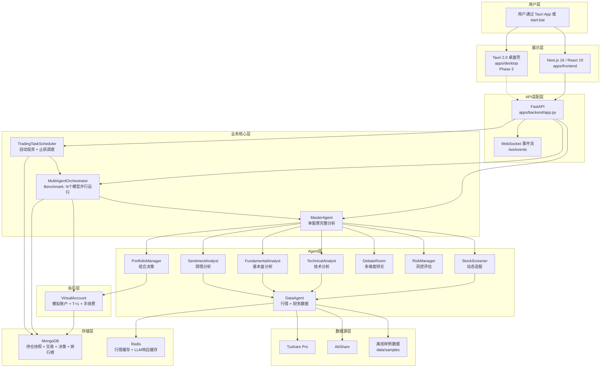
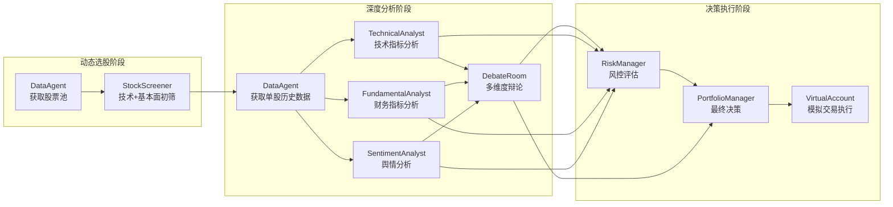
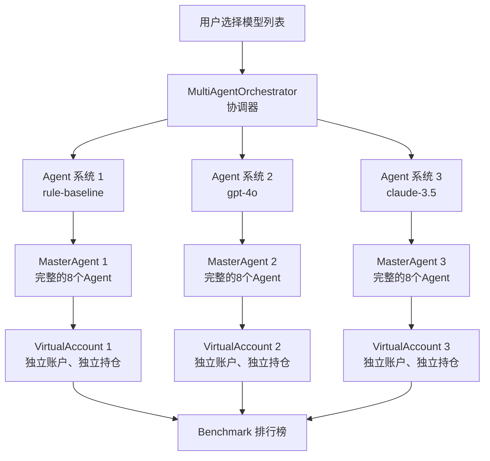
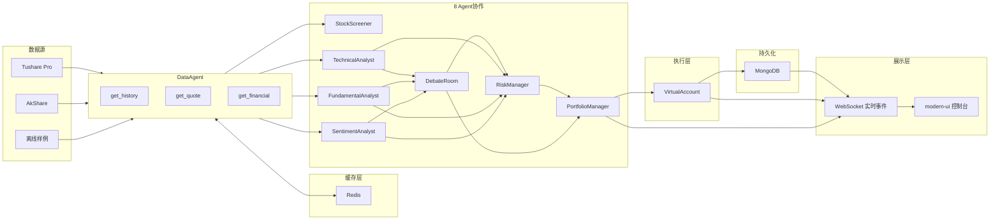

# 系统架构文档

更新时间：2026-06-06

本文档面向核心开发者，描述系统的整体架构、Agent协作方式、数据流和关键设计决策。

---

## 1. 系统整体架构

### 1.1 技术栈分层



### 1.2 架构分层说明

| 层次 | 职责 | 技术选择 |
|------|------|---------|
| **用户层** | 桌面App或命令行启动 | Tauri .exe (Phase 3) / start.bat |
| **展示层** | 现代化UI + 实时透明 | Next.js 16 + React 19 + Tailwind + Shadcn + React Flow + Recharts |
| **API适配层** | 后端适配 + WebSocket事件流 | FastAPI + WebSocket |
| **业务核心层** | Benchmark多模型比赛 + 自动调度 | MultiAgentOrchestrator + TradingTaskScheduler |
| **Agent层** | 8个专业Agent分工协作 | DataAgent, StockScreener, 5个分析Agent, DebateRoom, RiskManager, PortfolioManager |
| **执行层** | 模拟盘严格验证 | VirtualAccount (T+1, 手续费, 滑点, 止损) |
| **存储层** | 持久化 + 缓存 | MongoDB + Redis |
| **数据源层** | 行情 + 财务 + 舆情 | Tushare / AkShare / 离线样例 |

---

## 2. 8 Agent 协作架构

### 2.1 Agent协作流程图



### 2.2 Agent职责表

| Agent | 职责 | 输入 | 输出 | 代码位置 |
|-------|------|------|------|---------|
| **DataAgent** | 数据获取 + 缓存 | stock_code | 行情/财务数据 | `data/data_agent.py` |
| **StockScreener** | 动态选股 | 股票池 | 候选股票列表（按score排序） | `agents/screener.py` |
| **TechnicalAnalyst** | 技术面分析 | K线数据 | AnalysisResult（分数+标签+理由） | `agents/technical_analyst.py` |
| **FundamentalAnalyst** | 基本面分析 | 财务数据 | AnalysisResult | `agents/fundamental_analyst.py` |
| **SentimentAnalyst** | 舆情分析 | stock_code | AnalysisResult | `agents/sentiment_analyst.py` |
| **DebateRoom** | 多维度辩论 | 上游3个分析结果 | DebateResult（综合评分） | `agents/debate_room.py` |
| **RiskManager** | 风控评估 | 行情+分析结果 | RiskResult（建议仓位） | `agents/risk_manager.py` |
| **PortfolioManager** | 最终决策 | 所有上游结果 | DecisionResult（买/卖/持有） | `agents/portfolio_manager.py` |

### 2.3 完整分析流程示例

```python
# src/astock_agent_system/agents/master_agent.py

def analyze_stock(self, stock_code: str) -> StockAnalysisReport:
    # 1. 数据获取
    bars = self.data_agent.get_history(stock_code)
    quote = self.data_agent.get_quote(stock_code)
    financial = self.data_agent.get_financial(stock_code)
    
    # 2. 并行分析（每个Agent只做自己的事）
    technical = self.technical_analyst.analyze(stock_code, bars)
    fundamental = self.fundamental_analyst.analyze(financial)
    sentiment = self.sentiment_analyst.analyze(stock_code, ...)
    
    # 3. 综合研判
    debate = self.debate_room.analyze(stock_code, technical, fundamental, sentiment)
    
    # 4. 风控评估
    risk = self.risk_manager.analyze(stock_code, quote, technical, fundamental, sentiment, ...)
    
    # 5. 最终决策
    decision = self.portfolio_manager.decide(stock_code, quote, technical, fundamental, sentiment, debate, risk)
    
    return StockAnalysisReport(...)
```

代码位置：[`src/astock_agent_system/agents/master_agent.py`](../../src/astock_agent_system/agents/master_agent.py)

---

## 3. Benchmark 架构

系统只有一种运行模式：**Benchmark 模式**。

用户选择 N 个模型（N ≥ 1），每个模型驱动一个完整的独立 Agent 系统。

---

### 3.1 核心理念

**不是"单LLM vs 多LLM模式切换"，而是"用户选择几个模型进行 Benchmark"**

- ✅ 用户选择 N 个模型（N ≥ 1）
- ✅ 系统并行运行 N 个独立的 Agent 系统
- ✅ 每个模型 = 一个完整的 8 Agent 系统 + 一个独立的 VirtualAccount
- ✅ 互不干扰，独立决策，最后生成排行榜

**适用场景**：
- N = 1：只选一个模型，例如只看 rule-baseline 的表现（快速验证）
- N > 1：选多个模型，对比哪个驱动的系统表现更好（Benchmark对比）

---

### 3.2 Benchmark 架构图

**每个模型驱动一个独立的 Agent 系统**：

```
用户选择：[rule-baseline, gpt-4o, claude-3.5]
  ↓
系统并行运行 3 个独立的 Agent 系统

┌─────────────────────────────────┐
│ Agent 系统 1 (rule-baseline)     │
│   ├─ DataAgent                   │
│   ├─ StockScreener               │
│   ├─ TechnicalAnalyst            │
│   ├─ FundamentalAnalyst          │
│   ├─ SentimentAnalyst            │
│   ├─ DebateRoom                  │
│   ├─ RiskManager                 │
│   ├─ PortfolioManager            │
│   └─ VirtualAccount_1            │
│       (独立账户、独立持仓)        │
└─────────────────────────────────┘

┌─────────────────────────────────┐
│ Agent 系统 2 (gpt-4o)            │
│   ├─ ... (完整的8 Agent)         │
│   └─ VirtualAccount_2            │
│       (独立账户、独立持仓)        │
└─────────────────────────────────┘

┌─────────────────────────────────┐
│ Agent 系统 3 (claude-3.5)        │
│   ├─ ... (完整的8 Agent)         │
│   └─ VirtualAccount_3            │
│       (独立账户、独立持仓)        │
└─────────────────────────────────┘

  ↓ 运行结束后
  
生成 Benchmark 排行榜：
1. rule-baseline: 权益 105,000 (+5.0%)
2. gpt-4o:        权益 103,500 (+3.5%)
3. claude-3.5:    权益 102,000 (+2.0%)
```

**Mermaid 架构图**：



---

### 3.3 代码实现

**入口代码**：

```python
# src/astock_agent_system/orchestrator/multi_agent_orchestrator.py

orchestrator = MultiAgentOrchestrator(
    models=["rule-baseline", "gpt-4o", "claude-3.5"]  # 用户选择的模型列表
)

result = orchestrator.run_competition(max_count=5, history_days=24)

# result 包含：
# - 每个模型的独立账户状态
# - 排行榜（按收益率排序）
# - 每个账户的持仓、交易记录、决策日志
```

**关键逻辑**：

```python
def run_competition(self, max_count: int, history_days: int) -> dict:
    # 1. 为每个模型创建独立的 MasterAgent + VirtualAccount
    for model in self.models:
        master_agent = MasterAgent(llm_model=model)
        virtual_account = VirtualAccount(agent_id=model, initial_capital=100000)
        
        # 2. 独立运行
        report = master_agent.run_daily(max_count=max_count)
        
        # 3. 独立交易
        for decision in report.decisions:
            virtual_account.execute(decision)
    
    # 4. 生成排行榜
    rankings = sorted(accounts, key=lambda a: a.total_return, reverse=True)
    
    return {"rankings": rankings, "accounts": accounts}
```

代码位置：[`src/astock_agent_system/orchestrator/multi_agent_orchestrator.py`](../../src/astock_agent_system/orchestrator/multi_agent_orchestrator.py)

---

### 3.4 持仓恢复机制

**问题**：如果系统运行了多天，每个账户的持仓如何恢复？

**方案**：

```python
# MongoDB 存储每个账户的持仓快照
db.position_snapshots.insert_one({
    "agent_id": "gpt-4o",
    "date": "2026-06-05",
    "positions": [
        {"stock_code": "600519", "shares": 100, "cost": 1850.0}
    ],
    "cash": 95000.0,
    "equity": 105000.0
})

# 启动时恢复持仓
def restore_account(agent_id: str) -> VirtualAccount:
    snapshot = db.position_snapshots.find_one(
        {"agent_id": agent_id},
        sort=[("date", -1)]
    )
    
    account = VirtualAccount(agent_id=agent_id)
    account.restore_from_snapshot(snapshot)
    return account
```

---

### 3.5 幂等保护机制

**问题**：同一交易日重复运行，会导致重复买入

**解决方案**：
1. 每次运行后，保存账户快照到MongoDB，记录 `date` 字段
2. 下次运行时，检查快照的 `date` 是否等于当前 `trade_date`
3. 如果相等，跳过交易执行，直接返回快照结果

代码位置：[`src/astock_agent_system/orchestrator/multi_agent_orchestrator.py`](../../src/astock_agent_system/orchestrator/multi_agent_orchestrator.py) 的 `_is_same_trade_date_snapshot()`

---

## 4. 数据流图

### 4.1 完整数据流



### 4.2 数据流关键路径

1. **行情数据流**：Tushare/AkShare → Redis缓存 → DataAgent → 各Agent
2. **决策数据流**：各Agent分析 → RiskManager风控 → PortfolioManager决策 → VirtualAccount执行
3. **持久化流**：VirtualAccount交易 → MongoDB快照 → 下次运行恢复
4. **实时事件流**：Agent执行 → WebSocket推送 → modern-ui实时显示

---

## 5. VirtualAccount：模拟账户核心

### 5.1 职责

`VirtualAccount` 是模拟盘的**唯一交易执行层**，严格模拟A股交易规则：

- **T+1限制**：当天买入的股票，当天不能卖出
- **手续费**：买卖双向收取佣金（默认0.0003）
- **印花税**：卖出时收取（默认0.001）
- **滑点**：买入时价格上浮，卖出时价格下浮（默认0.001）
- **整手交易**：必须100股的整数倍
- **现金约束**：买入前检查现金是否足够，不足时自动调整为最大可买数量

### 5.2 核心方法

```python
# src/astock_agent_system/backtest/virtual_account.py

class VirtualAccount:
    def buy(self, stock_code, price, target_value, date, reason="") -> bool:
        """
        买入股票
        - 根据target_value计算shares（整百股）
        - 扣除手续费和滑点
        - 更新持仓和现金
        - 记录交易
        """
    
    def sell(self, stock_code, price, shares, date, reason="") -> bool:
        """
        卖出股票
        - T+1检查：如果last_buy_date == date，拒绝卖出
        - 扣除手续费、印花税和滑点
        - 更新持仓和现金
        - 记录交易和realized_pnl
        """
    
    def mark_to_market(self, date, prices) -> dict:
        """
        每日结算
        - 计算当前权益（现金 + 持仓市值）
        - 记录equity_curve
        """
    
    @classmethod
    def from_snapshot(cls, snapshot, ...) -> "VirtualAccount":
        """
        从MongoDB快照恢复账户
        - 恢复现金、持仓、历史交易
        - 支持长期运行和幂等保护
        """
```

代码位置：[`src/astock_agent_system/backtest/virtual_account.py`](../../src/astock_agent_system/backtest/virtual_account.py)

---

## 6. TradingTaskScheduler：自动投资调度器

### 6.1 职责

`TradingTaskScheduler` 负责长期自动运行：

- 每天交易日的指定时间（默认15:30）运行一次自动投资轮次
- 每隔N分钟检查一次止损（默认30分钟）
- 支持离线/在线模式
- 支持配置默认模型列表

### 6.2 核心方法

```python
# src/astock_agent_system/scheduler/trading_task_scheduler.py

class TradingTaskScheduler:
    def run_auto_investment(self, models=None, offline=False, max_count=None, history_days=None) -> dict:
        """
        运行一次自动投资轮次
        - 调用 MultiAgentOrchestrator.run_competition()
        - 返回排行榜 + 每个账户详情
        """
    
    def check_stop_loss(self) -> dict:
        """
        检查所有账户的止损
        - 从MongoDB读取最新快照
        - 对每个持仓检查当前价格 vs 成本价
        - 如果跌幅超过阈值，强制卖出
        """
    
    def start(self):
        """
        启动长期调度器
        - 使用APScheduler
        - 每天SCHEDULER_DAILY_RUN_TIME运行auto_investment
        - 每STOP_LOSS_INTERVAL_MINUTES检查止损
        """
```

代码位置：[`src/astock_agent_system/scheduler/trading_task_scheduler.py`](../../src/astock_agent_system/scheduler/trading_task_scheduler.py)

---

## 7. 代码组织

```
src/astock_agent_system/
├── agents/                      # Agent层
│   ├── master_agent.py          # 主控Agent
│   ├── screener.py              # 动态选股
│   ├── technical_analyst.py    # 技术分析
│   ├── fundamental_analyst.py  # 基本面分析
│   ├── sentiment_analyst.py    # 舆情分析
│   ├── debate_room.py          # 多维度辩论
│   ├── risk_manager.py         # 风控评估
│   └── portfolio_manager.py    # 组合决策
├── orchestrator/                # 协调层
│   └── multi_agent_orchestrator.py  # Benchmark协调器
├── scheduler/                   # 调度层
│   └── trading_task_scheduler.py    # 自动投资调度
├── backtest/                    # 执行层
│   └── virtual_account.py      # 模拟账户
├── data/                        # 数据层
│   └── data_agent.py           # 数据获取 + 缓存
├── models/                      # 数据模型
├── llm/                         # LLM客户端
└── cli/                         # CLI入口

apps/
├── backend/                     # FastAPI后端
│   ├── app.py                  # API路由 + WebSocket
│   ├── adapters.py             # 适配器
│   └── schemas.py              # Pydantic模型
└── frontend/                    # Next.js前端
    └── src/
        ├── components/
        │   └── trading-dashboard.tsx  # 主控制台
        └── lib/
            └── dashboard-api.ts       # API客户端
```

---

## 8. 下一步阅读

- [流程与时序](FLOWS.md) - 理解从启动到交易的完整流程
- [设计决策](DESIGN_DECISIONS.md) - 理解为什么这么设计
- [同类项目对比](COMPARISON.md) - 和其他项目比有什么优势
- [需求映射](USER_NEEDS_MAPPING.md) - 用户场景如何映射到代码位置
