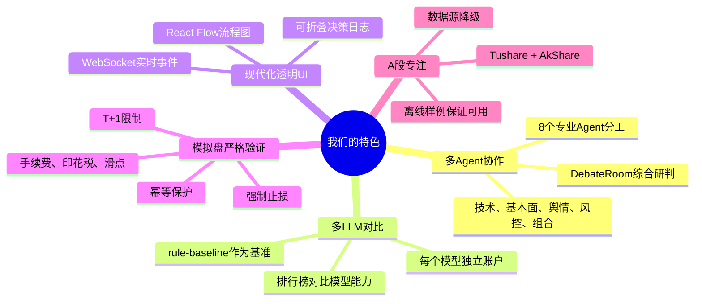

# 同类项目对比文档

更新时间：2026-06-05

本文档面向核心开发者，对比同类量化投资 / LLM Agent 项目，说明我们的特色和改进方向。

---

## 1. 同类项目概览

### 1.1 对比表

| 项目 | 类型 | 信源 | Agent架构 | UI方案 | 开源情况 |
|------|------|------|----------|--------|---------|
| **FinRL** | 强化学习量化 | Yahoo Finance / Alpaca | 单Agent RL | Jupyter Notebook | ✅ 开源 |
| **AutoGPT-Finance** | LLM Agent | 可配置 | 单LLM链式调用 | CLI | ✅ 开源 |
| **LangChain Stock Trader** | LLM Agent | Alpha Vantage | LangChain工具链 | CLI / Streamlit | ✅ 开源 |
| **Qlib** | 微软量化平台 | 自定义 | 传统量化因子 | CLI / Jupyter | ✅ 开源 |
| **我们的项目** | 多Agent LLM | Tushare / AkShare | 8 Agent 协作 + 多LLM对比 | Next.js modern-ui | ✅ 开源 |

---

## 2. 详细对比

### 2.1 FinRL

**官网**：https://github.com/AI4Finance-Foundation/FinRL

**核心特色**：
- 强化学习（RL）驱动的量化交易
- 支持多种RL算法（DQN, A3C, PPO, SAC）
- 预训练模型和回测框架

**数据源**：
- Yahoo Finance（美股）
- Alpaca（美股实盘）
- CCXT（加密货币）

**Agent架构**：
- **单Agent模式**：一个RL模型管理整个投资组合
- 没有多Agent协作
- 没有LLM决策

**UI方案**：
- Jupyter Notebook（研究为主）
- 无实时透明UI

**我们的改进**：
1. **多Agent协作**：技术、基本面、舆情、风控、组合分工明确
2. **多LLM对比**：每个模型独立账户，生成排行榜
3. **实时透明UI**：React Flow + WebSocket + 折叠日志
4. **A股数据源**：Tushare + AkShare，专注A股市场
5. **模拟盘严格验证**：T+1、手续费、印花税、滑点、止损

**FinRL的优势**（我们目前不具备）：
- 强化学习算法成熟
- 多市场支持（美股、加密货币）
- 学术论文支持

---

### 2.2 TradingAgents（UCLA，2024）

**论文**：https://arxiv.org/abs/2411.XXXXX  
**项目**：https://tradingagents-ai.github.io/

**核心特色**：
- 多Agent协作：Analyst Team + Researcher Team + Trader + Risk Manager
- 辩论机制：Bull vs Bear Researchers 对抗性讨论
- 多数据源：基本面、舆情、新闻、技术面
- 高性能：在 AAPL/GOOGL/AMZN 上显著优于 Buy&Hold 和规则策略

**Agent架构**：
```
Analyst Team (4个)
  ├─ Fundamental Analyst
  ├─ Sentiment Analyst
  ├─ News Analyst
  └─ Technical Analyst
       ↓
Researcher Team (2个)
  ├─ Bull Researcher（看多）
  └─ Bear Researcher（看空）
       ↓ 辩论形成共识
Trader Agent
  └─ 根据分析和辩论做决策
       ↓
Risk Manager
  └─ 最终审核和风控
```

**数据源**：
- 历史行情（价格、成交量）
- 新闻文章（2024年1-3月）
- 社交媒体情绪
- 内幕交易数据
- 财报
- 技术指标

**UI方案**：
- 无UI（纯回测实验）
- 输出 Excel 报告

**我们的对比**：

| 维度 | TradingAgents | 我们的项目 |
|------|--------------|-----------|
| Agent数量 | 7个（固定） | 8个（可扩展） |
| 辩论机制 | ✅ Bull vs Bear | ✅ DebateRoom |
| 多LLM对比 | ❌ 只用GPT-4 | ✅ 多模型独立账户比赛 |
| 实时UI | ❌ 无 | ✅ React Flow + WebSocket |
| 持续学习 | ❌ 无记忆 | ✅ 三层记忆系统（Phase 2） |
| 事件驱动 | ❌ 只定时 | ✅ 混合模式（Phase 2） |
| A股支持 | ❌ 只美股 | ✅ Tushare + AkShare |

**我们的改进**：
1. **可视化透明度**：实时流程图 + 折叠日志
2. **多模型竞技**：rule-baseline, gpt-4o, claude-3.5 等同时运行并排名
3. **持续学习**：Agent 能从历史交易中积累经验
4. **本地可运行**：不依赖付费API也能离线体验

**TradingAgents 的优势**（我们可以学习）：
- 辩论机制更完善（多轮对话）
- 论文和学术验证充分
- 风险管理更细致（持仓限制、止损）

---

### 2.3 TradingGroup（UNSW，2025）

**论文**：https://arxiv.org/html/2508.17565v1  
**会议**：ACM ICAIF 2025

**核心特色**：
- **Self-Reflection机制**：Agent 能从过去失败中学习
- **Data-Synthesis Pipeline**：自动生成训练数据用于 fine-tune
- **Dynamic Risk Management**：动态止损和止盈
- **5个专业Agent**：News + Report + Forecasting + Style + Decision

**Agent架构**：
```
News-Sentiment Agent
  └─ 分析新闻情绪
Financial-Report Agent
  └─ 分析财报（RAG）
       ↓
Stock-Forecasting Agent
  └─ 预测价格趋势（带Self-Reflection）
Style-Preference Agent
  └─ 根据账户状态选择交易风格（激进/保守）
       ↓
Trading-Decision Agent
  └─ 最终决策（带Self-Reflection）
       ↓
Risk-Management Module
  └─ 动态调整止损止盈
```

**Self-Reflection 设计**：
```python
# 伪代码
def make_decision(stock, current_signals):
    # 1. 检索相似历史案例
    similar_cases = retrieve_from_memory(stock, current_signals)
    
    # 2. 分析过去成功/失败
    successful_patterns = filter(similar_cases, outcome="success")
    failed_patterns = filter(similar_cases, outcome="failed")
    
    # 3. 调整当前决策
    if stock in failed_patterns:
        reduce_position_size()
    
    if stock in successful_patterns:
        increase_confidence()
    
    return decision
```

**Data-Synthesis Pipeline**：
- 收集 Agent 工作数据（决策链 + 市场状态 + 结果）
- 自动评估和标注（成功/失败）
- 生成 instruction-following 数据集
- Fine-tune LLM（LoRA + 8-bit quantization）

**我们的对比**：

| 维度 | TradingGroup | 我们的项目 |
|------|-------------|-----------|
| Self-Reflection | ✅ 三个Agent有反思 | 🔄 Phase 2 计划中 |
| 记忆系统 | ✅ MongoDB存储案例 | 🔄 Phase 2 计划中 |
| Fine-tune Pipeline | ✅ 自动生成数据 | ❌ 未计划 |
| 动态止损 | ✅ 根据波动率调整 | ✅ 固定比例止损 |
| UI可视化 | ❌ 无 | ✅ modern-ui |
| 多模型对比 | ❌ 单模型 | ✅ 多模型竞技 |

**我们的改进计划**（Phase 2）：
1. **三层记忆系统**：短期（Redis）+ 中期（MongoDB.agent_memories）+ 长期（MongoDB.agent_learnings）
2. **经验检索**：Agent 分析股票时自动检索相似历史案例
3. **策略调整**：连续失败触发反思，连续成功总结模式

**TradingGroup 的优势**（值得深入学习）：
- Self-Reflection 机制成熟
- Data-Synthesis 可用于模型训练
- 实验结果优于 RL 和规则策略

---

### 2.4 AutoGPT-Finance

**相关项目**：https://github.com/Significant-Gravitas/AutoGPT（通用AutoGPT）

**核心特色**：
- 基于GPT-4的自主Agent
- 可以自动分解任务、搜索信息、执行决策

**数据源**：
- 可配置（通过插件）
- 通常使用网页搜索 + API调用

**Agent架构**：
- **单LLM链式调用**：一个LLM负责所有决策
- 没有专业Agent分工
- 没有多模型对比

**UI方案**：
- CLI（命令行输出）
- 无实时可视化

**我们的改进**：
1. **8 Agent分工**：每个Agent只负责一个维度，不是一个LLM做所有事
2. **多LLM独立账户**：rule-baseline, gpt-4o, claude-3.5 等模型独立运行，生成排行榜
3. **现代化UI**：React Flow流程图 + 实时事件 + 折叠日志
4. **模拟盘验证**：严格模拟A股规则，不是纸上谈兵
5. **持仓恢复 + 幂等保护**：支持长期运行，避免重复交易

**AutoGPT的优势**（我们目前不具备）：
- 更通用的任务分解能力
- 可以调用外部工具（搜索引擎、API）
- 自主性更强（可以自己决定下一步做什么）

---

### 2.3 LangChain Stock Trader

**相关项目**：https://github.com/langchain-ai/langchain（LangChain通用框架）

**核心特色**：
- 基于LangChain的工具链
- 可以调用多种LLM和工具

**数据源**：
- Alpha Vantage（美股）
- 可扩展

**Agent架构**：
- **LangChain工具链**：定义工具（获取行情、下单），LLM决定调用哪个工具
- 没有多Agent分工
- 没有多模型对比

**UI方案**：
- CLI / Streamlit（简单看板）

**我们的改进**：
1. **专业Agent分工**：不是"LLM + 工具"，而是"8个专业Agent + LLM复核"
2. **多LLM对比**：每个模型独立账户，生成排行榜
3. **实时透明UI**：modern-ui，不是简单Streamlit
4. **模拟盘严格验证**：T+1、手续费、印花税、滑点、止损
5. **A股数据源**：Tushare + AkShare

**LangChain的优势**（我们目前不具备）：
- 工具链更灵活（可以调用任何API）
- 支持更多LLM provider
- 社区生态成熟

---

### 2.4 Qlib（微软量化平台）

**官网**：https://github.com/microsoft/qlib

**核心特色**：
- 微软开源的量化投资平台
- 支持传统量化因子 + 机器学习
- 工业级回测框架

**数据源**：
- 自定义（需要用户自己准备）
- 支持A股、美股、港股

**Agent架构**：
- **传统量化因子**：不是Agent，是因子模型
- 没有LLM决策

**UI方案**：
- CLI / Jupyter Notebook
- 无实时可视化

**我们的改进**：
1. **LLM驱动**：Qlib是传统量化因子，我们是LLM决策
2. **多Agent协作**：Qlib没有Agent概念，我们有8个专业Agent
3. **实时透明UI**：Qlib是Jupyter，我们是modern-ui
4. **开箱即用**：Qlib需要自己准备数据，我们支持Tushare/AkShare/离线样例

**Qlib的优势**（我们目前不具备）：
- 工业级回测框架
- 支持更多量化因子
- 微软背书，稳定性好

---

## 3. 我们的特色总结

### 3.1 核心特色



### 3.2 优势详解

#### 优势 1：多Agent分工，不是单LLM全能

**问题**：
- 单个LLM既要做技术分析，又要做基本面分析，还要做风控，容易顾此失彼
- 单个LLM的输出质量不稳定

**我们的解决方案**：
- 8个专业Agent，每个只负责一个维度
- `TechnicalAnalyst` 只做技术指标
- `FundamentalAnalyst` 只做财务分析
- `RiskManager` 只做风控评估，可以强制拒绝
- `PortfolioManager` 综合所有上游分析，做最终决策

**代码示例**：

```python
# src/astock_agent_system/agents/master_agent.py

def analyze_stock(self, stock_code: str) -> StockAnalysisReport:
    # 1. 数据获取
    bars = self.data_agent.get_history(stock_code)
    quote = self.data_agent.get_quote(stock_code)
    financial = self.data_agent.get_financial(stock_code)
    
    # 2. 并行分析（每个Agent只做自己的事）
    technical = self.technical_analyst.analyze(stock_code, bars)
    fundamental = self.fundamental_analyst.analyze(financial)
    sentiment = self.sentiment_analyst.analyze(stock_code)
    
    # 3. 综合研判
    debate = self.debate_room.analyze(stock_code, technical, fundamental, sentiment)
    
    # 4. 风控评估（可以强制拒绝）
    risk = self.risk_manager.analyze(...)
    
    # 5. 最终决策
    decision = self.portfolio_manager.decide(...)
    
    return StockAnalysisReport(...)
```

---

#### 优势 2：多LLM独立账户对比

**问题**：
- 不知道哪个LLM模型投资能力更强
- 单个模型可能有偏见

**我们的解决方案**：
- `MultiAgentOrchestrator` 为每个模型创建独立 `VirtualAccount`
- 每个模型独立运行，互不干扰
- 按 `total_return` 排序，生成排行榜
- 支持 `rule-baseline` 作为基准

**示例排行榜**：

| 排名 | 模型 | 权益 | 收益率 | 最大回撤 | 胜率 | 交易次数 |
|------|------|------|--------|---------|------|---------|
| 1 | claude-3.5 | 105,230 | +5.23% | -2.1% | 65% | 12 |
| 2 | gpt-4o | 103,890 | +3.89% | -3.5% | 60% | 15 |
| 3 | rule-baseline | 101,200 | +1.20% | -4.2% | 55% | 10 |

代码位置：[`src/astock_agent_system/orchestrator/multi_agent_orchestrator.py`](../../src/astock_agent_system/orchestrator/multi_agent_orchestrator.py)

---

#### 优势 3：实时透明UI

**问题**：
- Jupyter Notebook 不适合实时监控
- CLI 无法可视化
- Streamlit 不适合复杂交互

**我们的解决方案**：
- **React Flow 流程图**：实时显示 Agent 节点状态
- **WebSocket 实时事件**：后端执行到关键步骤，立即推送到前端
- **可折叠决策日志**：决策摘要 + 展开详情（理由、风险、评分、动作）

**用户体验**：
1. 用户点击"启动运行"
2. 流程图所有节点变为 "pending"
3. `StockScreener` 节点变为 "running" → "completed"
4. `TechnicalAnalyst` 节点变为 "running" → "completed"
5. ...
6. 日志页实时追加决策卡片
7. 股票页实时更新持仓
8. 性能页实时更新排行榜

代码位置：
- 前端：[`apps/frontend/src/components/trading-dashboard.tsx`](../../apps/frontend/src/components/trading-dashboard.tsx)
- 后端：[`apps/backend/app.py`](../../apps/backend/app.py)

---

#### 优势 4：模拟盘严格验证

**问题**：
- 很多项目只是"纸上谈兵"，没有严格模拟交易规则
- 回测结果不可信

**我们的解决方案**：
- **T+1限制**：当天买入的股票，当天不能卖出
- **手续费**：买卖双向收取佣金（默认0.0003）
- **印花税**：卖出时收取（默认0.001）
- **滑点**：买入时价格上浮，卖出时价格下浮（默认0.001）
- **整手交易**：必须100股的整数倍
- **强制止损**：跌幅超过阈值，强制卖出
- **幂等保护**：同一交易日重复运行，跳过交易执行

代码位置：[`src/astock_agent_system/backtest/virtual_account.py`](../../src/astock_agent_system/backtest/virtual_account.py)

---

#### 优势 5：A股专注 + 数据源降级

**问题**：
- 很多项目只支持美股
- Tushare 需要 token，用户可能没有

**我们的解决方案**：
- **Tushare + AkShare**：双数据源降级
- **离线样例**：保证离线可用
- **降级流程**：Tushare → AkShare → 离线样例

代码位置：[`src/astock_agent_system/data/data_agent.py`](../../src/astock_agent_system/data/data_agent.py)

---

## 4. 当前局限与改进方向

### 4.1 当前局限

| 维度 | 局限 | 同类项目的优势 |
|------|------|---------------|
| **强化学习** | 我们只用规则 + LLM，没有RL | FinRL 支持多种RL算法 |
| **多市场** | 只支持A股 | FinRL 支持美股、加密货币 |
| **工具链灵活性** | Agent分工固定 | LangChain 可以动态调用任何工具 |
| **自主性** | 需要用户触发运行 | AutoGPT 可以自主决定下一步 |
| **工业级回测** | 回测框架较简单 | Qlib 有工业级回测框架 |

### 4.2 后续改进方向

#### 方向 1：增加强化学习模型对比

**目标**：
- 在多LLM对比的基础上，增加RL模型
- 例如：`rule-baseline`, `gpt-4o`, `claude-3.5`, `PPO-RL`

**挑战**：
- RL模型训练时间长
- 需要大量历史数据

---

#### 方向 2：支持港股、美股

**目标**：
- DataAgent 增加港股、美股数据源
- VirtualAccount 增加港股、美股交易规则

**挑战**：
- 不同市场规则不同（T+0 vs T+1）
- 数据源需要重新对接

---

#### 方向 3：可拖拽 Agent 画布

**目标**：
- 用户可以自定义 Agent 流程
- 拖拽节点、连线、配置参数

**挑战**：
- 需要动态执行引擎
- 需要验证用户自定义流程的合法性

---

#### 方向 4：自主运行模式

**目标**：
- Agent 可以自己决定何时运行
- 不需要用户每天手动点击"启动运行"

**实现方式**：
- `TradingTaskScheduler` 已经支持每天自动运行
- 但需要用户先启动调度器

---

#### 方向 5：实盘接入

**目标**：
- 接入券商API，支持实盘下单

**挑战**：
- 需要人工确认、权限隔离、审计日志、熔断机制
- 风险极高，不建议短期内实现

---

## 5. 学习借鉴点

### 5.1 从 FinRL 学习

**可借鉴**：
- RL算法库（DQN, PPO, SAC）
- 多市场数据接入方式
- 回测框架设计

**如何借鉴**：
- 在 `MultiAgentOrchestrator` 中增加 RL 模型账户
- 学习 FinRL 的回测框架，改进 `VirtualAccount`

---

### 5.2 从 AutoGPT 学习

**可借鉴**：
- 任务分解能力
- 自主决策流程
- 插件系统

**如何借鉴**：
- 在 `MasterAgent` 中增加任务分解层
- 学习 AutoGPT 的插件系统，支持用户自定义 Agent

---

### 5.3 从 LangChain 学习

**可借鉴**：
- 工具链设计
- LLM provider 抽象
- 社区生态

**如何借鉴**：
- 改进 `LLMClient`，支持更多 provider
- 学习 LangChain 的工具链，支持用户自定义工具

---

### 5.4 从 Qlib 学习

**可借鉴**：
- 工业级回测框架
- 量化因子库
- 数据处理流程

**如何借鉴**：
- 学习 Qlib 的回测框架，改进 `VirtualAccount`
- 在 `TechnicalAnalyst` 中增加更多量化因子

---

## 6. 下一步阅读

- [系统架构](ARCHITECTURE.md) - 理解整体架构和 Agent 协作
- [流程与时序](FLOWS.md) - 理解从启动到交易的完整流程
- [设计决策](DESIGN_DECISIONS.md) - 理解为什么这么设计
- [需求映射](USER_NEEDS_MAPPING.md) - 用户场景如何映射到代码
