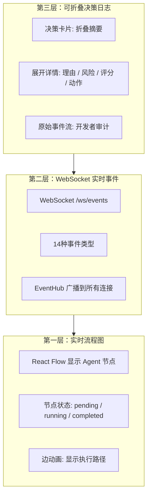
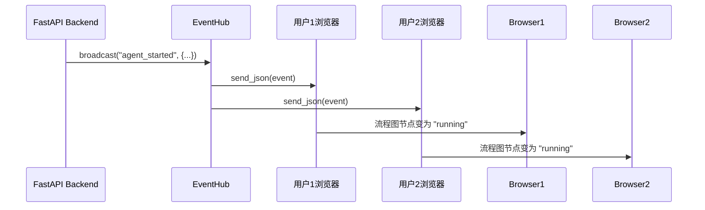
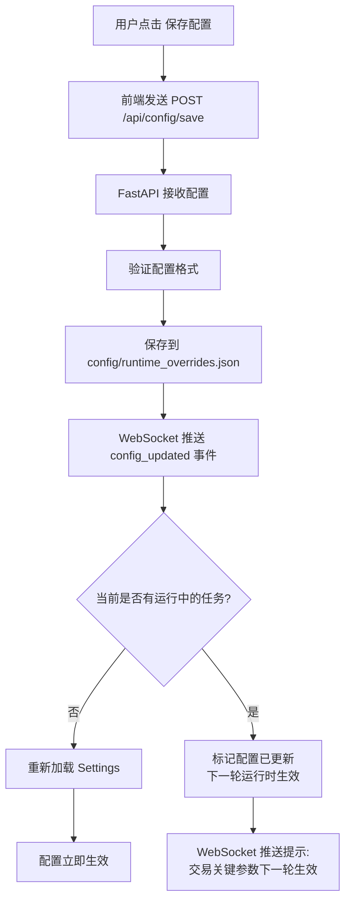
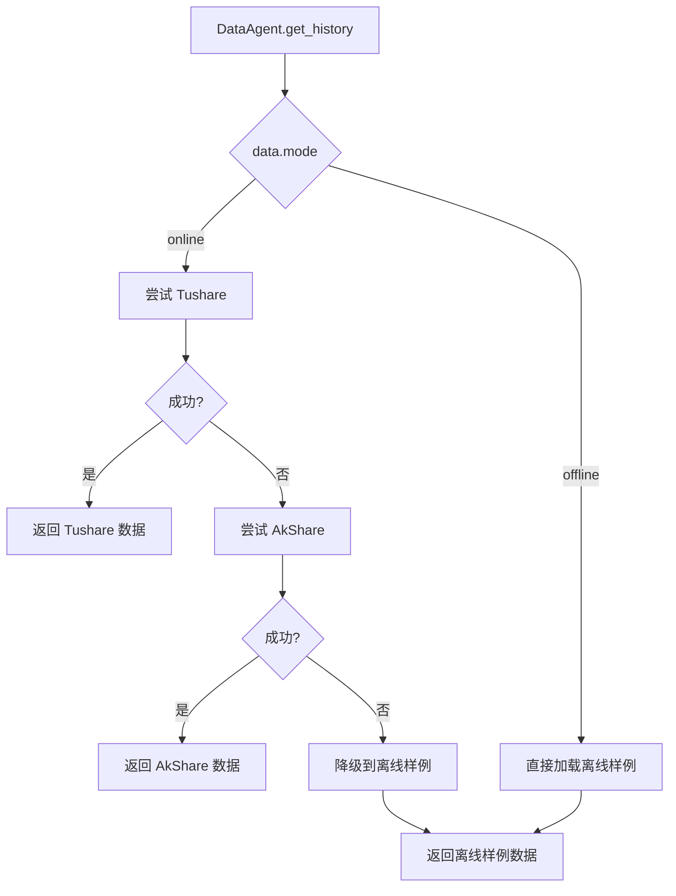

# 设计决策文档

更新时间：2026-06-05

本文档面向核心开发者，解释关键技术选型、架构决策的理由和权衡。

---

## 1. UI 框架选型

### 1.1 选型对比表

| 技术 | 为什么选 | 优势 | 潜在风险 |
|------|---------|------|---------|
| **Next.js 16 + React 19** | 面向桌面产品，SSR/SSG能力，生态成熟 | 1. SSR/SSG提升首屏速度<br/>2. 文件路由简化开发<br/>3. React 19新特性（Server Components, Actions） | 版本迭代快，部分依赖可能不兼容 |
| **Tailwind CSS 4** | 快速构建现代UI，utility-first | 1. 无需写CSS文件<br/>2. 响应式设计简单<br/>3. 构建时tree-shaking，体积小 | 学习曲线陡峭，HTML变长 |
| **Shadcn UI** | 高质量组件库，可定制 | 1. 组件直接copy到项目，完全可控<br/>2. 基于Radix UI，无障碍支持好<br/>3. Tailwind集成完美 | 非npm包，需要手动更新 |
| **Lucide Icons** | 轻量级图标库 | 1. Tree-shakeable，只打包用到的图标<br/>2. 图标一致性好<br/>3. React组件形式，易用 | 图标数量少于Font Awesome |
| **React Flow** | Agent流程图可视化 | 1. 节点/边可定制<br/>2. 支持动画和交互<br/>3. 后续可扩展为拖拽式Agent画布 | 复杂图性能可能受限 |
| **Recharts** | 权益曲线、回撤、排行榜图表 | 1. 基于D3，功能强大<br/>2. React组件形式，声明式<br/>3. 响应式设计好 | 自定义样式较复杂 |
| **Tauri 2.0** | 后续桌面打包，Python sidecar方案 | 1. Rust核心，体积小、性能好<br/>2. 支持sidecar启动Python后端<br/>3. 跨平台（Windows/macOS/Linux） | Rust工具链复杂，sidecar生命周期管理需谨慎 |

### 1.2 为什么不用 Streamlit

**Streamlit 优势**：
- 快速原型开发（纯Python，无需前端知识）
- 适合数据科学/机器学习项目

**Streamlit 局限**：
- **不适合复杂交互**：实时WebSocket、可折叠日志、拖拽节点等需求难以实现
- **UI定制受限**：无法完全控制布局和样式
- **性能问题**：每次交互都会重新运行整个脚本
- **不适合桌面产品**：无法打包为独立可执行文件

**结论**：
- Streamlit 适合作为**开发调试看板**（fallback）
- modern-ui 作为**正式产品入口**，提供更好的用户体验

---

## 2. 智能体透明化实现

### 2.1 透明化的三个层次



### 2.2 React Flow 实时流程图

**职责**：
- 显示 8 Agent 节点 + 连线
- 实时更新节点状态（pending → running → completed）
- 显示流动箭头动画

**实现方式**：

```typescript
// apps/frontend/src/components/trading-dashboard.tsx

const [flowNodes, setFlowNodes] = useState(FALLBACK_FLOW_NODES);
const [flowEdges, setFlowEdges] = useState(FALLBACK_FLOW_EDGES);
const [nodeStateMap, setNodeStateMap] = useState<Record<string, LiveNodeState>>({});

// WebSocket 事件处理
function handleEvent(event: BackendEvent) {
  if (event.type === "agent_started") {
    setNodeStateMap(prev => ({
      ...prev,
      [event.agent_id]: { status: "running", timestamp: event.timestamp }
    }));
  }
  
  if (event.type === "agent_completed") {
    setNodeStateMap(prev => ({
      ...prev,
      [event.agent_id]: { status: "completed", timestamp: event.timestamp }
    }));
  }
}

// 渲染
<ReactFlow
  nodes={flowNodes.map(node => ({
    ...node,
    data: {
      ...node.data,
      status: nodeStateMap[node.id]?.status || "idle"
    }
  }))}
  edges={flowEdges}
/>
```

**节点状态样式**：
- `idle`：灰色边框
- `pending`：黄色边框
- `running`：蓝色边框 + 脉冲动画
- `completed`：绿色边框

代码位置：`apps/frontend/src/components/trading-dashboard.tsx`

### 2.3 WebSocket 实时事件推送

**职责**：
- 后端执行到关键步骤时，推送事件到前端
- 前端实时更新 UI

**实现架构**：



**事件推送位置**：

| 阶段 | 推送时机 | 事件类型 |
|------|---------|---------|
| **启动** | `MultiAgentOrchestrator.run_competition()` 开始 | `run_started` |
| **选股** | `StockScreener.screen()` 开始/完成 | `agent_started` / `agent_completed` |
| **分析** | 每个 Agent 开始/完成 | `agent_started` / `agent_completed` |
| **决策** | `PortfolioManager.decide()` 完成 | `decision_made` |
| **交易** | `VirtualAccount.buy()` / `sell()` 完成 | `trade_executed` |
| **止损** | 触发止损 | `stop_loss_triggered` |
| **完成** | 排行榜生成完成 | `run_completed` |

代码位置：
- 后端：`apps/backend/app.py` 的 `EventHub`
- 前端：`apps/frontend/src/components/trading-dashboard.tsx` 的 `handleEvent()`

### 2.4 可折叠决策日志

**职责**：
- 以卡片形式展示决策摘要
- 用户点击展开：显示完整理由、风险、评分、动作

**UI 设计**：

```
┌─────────────────────────────────────────────────────┐
│ 600519 贵州茅台  BUY  置信度 75%          [展开 ▼]  │
│                                                     │
│ 决策理由：技术面强势突破 + 基本面稳健 + 舆情积极   │
└─────────────────────────────────────────────────────┘

用户点击"展开"：

┌─────────────────────────────────────────────────────┐
│ 600519 贵州茅台  BUY  置信度 75%          [收起 ▲]  │
│                                                     │
│ 决策理由：技术面强势突破 + 基本面稳健 + 舆情积极   │
│                                                     │
│ ┌─ 技术面 ─────────────────────────────┐           │
│ │ 评分：0.8                             │           │
│ │ 信号：BUY                             │           │
│ │ 理由：MACD金叉 + RSI超卖反弹          │           │
│ └────────────────────────────────────┘           │
│                                                     │
│ ┌─ 基本面 ─────────────────────────────┐           │
│ │ 评分：0.85                            │           │
│ │ PE：30.5  ROE：25%                   │           │
│ │ 理由：盈利稳健，估值合理              │           │
│ └────────────────────────────────────┘           │
│                                                     │
│ ┌─ 风险评估 ───────────────────────────┐           │
│ │ 风险评分：0.3（低风险）               │           │
│ │ 是否拒绝：否                          │           │
│ └────────────────────────────────────┘           │
│                                                     │
│ ┌─ 最终动作 ───────────────────────────┐           │
│ │ 动作：BUY                             │           │
│ │ 仓位比例：10%                         │           │
│ │ 状态：已执行（买入200股）             │           │
│ └────────────────────────────────────┘           │
└─────────────────────────────────────────────────────┘
```

**实现方式**：

```typescript
const [expandedDecisions, setExpandedDecisions] = useState<Set<string>>(new Set());

function toggleDecision(id: string) {
  setExpandedDecisions(prev => {
    const next = new Set(prev);
    if (next.has(id)) {
      next.delete(id);
    } else {
      next.add(id);
    }
    return next;
  });
}

// 渲染
{decisions.map(decision => (
  <DecisionCard
    key={decision.id}
    decision={decision}
    expanded={expandedDecisions.has(decision.id)}
    onToggle={() => toggleDecision(decision.id)}
  />
))}
```

---

## 3. 配置热加载策略

### 3.1 配置分类

| 配置类型 | 示例 | 生效时机 | 运行中修改的影响 |
|---------|------|---------|----------------|
| **安全参数** | 日志级别、UI主题、缓存TTL | 立即生效 | 无影响，可以立即生效 |
| **交易关键参数** | 止损阈值、模型列表、初始资金 | 下一轮生效 | 如果立即生效，会导致运行中账户状态不一致 |
| **数据源参数** | Tushare Token、LLM API Key | 下一次调用生效 | 需要重新初始化客户端 |

### 3.2 热加载流程



### 3.3 实现细节

**后端保存配置**：

```python
# apps/backend/app.py

@app.post("/api/config/save")
async def save_config(request: ConfigUpdateRequest):
    # 1. 保存到 runtime_overrides.json
    save_runtime_overrides(request.config)
    
    # 2. 广播配置更新事件
    await event_hub.broadcast({
        "type": "config_updated",
        "timestamp": _now_iso(),
        "payload": {"keys": list(request.config.keys())}
    })
    
    # 3. 检查是否有运行中的任务
    if run_store.current_run is not None:
        return {
            "status": "deferred",
            "message": "配置已保存，交易关键参数将在下一轮运行时生效"
        }
    
    # 4. 立即重新加载配置
    global settings
    settings = load_settings()
    
    return {"status": "ok", "message": "配置已保存并立即生效"}
```

**前端处理**：

```typescript
async function handleSaveConfig() {
  setSavingConfig(true);
  
  const response = await fetch("/api/config/save", {
    method: "POST",
    body: JSON.stringify({ config: configDraft })
  });
  
  const result = await response.json();
  
  if (result.status === "deferred") {
    // 显示提示：交易关键参数下一轮生效
    showToast("配置已保存，部分参数将在下一轮运行时生效");
  } else {
    showToast("配置已保存并立即生效");
  }
  
  setSavingConfig(false);
  setConfigDirty(false);
}
```

### 3.4 权衡与风险

**优势**：
- 用户不需要重启后端，提升体验
- 安全参数可以立即调试

**风险**：
- 交易关键参数热加载可能导致运行中账户状态不一致
- 例如：运行中修改止损阈值，可能导致部分持仓已按旧阈值检查，部分按新阈值检查

**解决方案**：
- 交易关键参数延迟到下一轮生效
- 前端明确提示用户哪些参数立即生效，哪些延迟生效

---

## 4. 为什么选择 FastAPI + WebSocket

### 4.1 对比表

| 方案 | 优势 | 劣势 | 是否选用 |
|------|------|------|---------|
| **Flask + SSE** | 1. Flask轻量<br/>2. SSE实现简单 | 1. SSE单向推送，无法接收客户端消息<br/>2. Flask对WebSocket支持不好 | ❌ |
| **FastAPI + WebSocket** | 1. 原生WebSocket支持<br/>2. 双向通信<br/>3. 异步性能好<br/>4. 类型提示+自动文档 | 1. 学习曲线陡峭<br/>2. 异步代码调试复杂 | ✅ 选用 |
| **Django Channels** | 1. Django生态成熟<br/>2. Channels支持WebSocket | 1. Django过重<br/>2. 需要Redis/RabbitMQ做消息层 | ❌ |
| **Tornado** | 1. 异步性能极好 | 1. 生态较小<br/>2. 代码风格老旧 | ❌ |

### 4.2 为什么需要 WebSocket

**问题**：如果只用 HTTP API，前端如何获取实时事件？

**方案对比**：

| 方案 | 实现方式 | 优势 | 劣势 |
|------|---------|------|------|
| **轮询** | 前端每秒请求 `/api/events` | 实现简单 | 1. 延迟高<br/>2. 资源浪费<br/>3. 服务器压力大 |
| **长轮询** | 前端请求 `/api/events`，服务器hold住，有事件时返回 | 延迟低 | 1. 实现复杂<br/>2. 连接数受限 |
| **SSE** | 服务器主动推送事件流 | 1. 标准协议<br/>2. 实现简单 | 1. 只能服务器推送<br/>2. 无法接收客户端消息 |
| **WebSocket** | 双向通信 | 1. 延迟低<br/>2. 双向通信<br/>3. 连接复用 | 实现稍复杂 |

**结论**：WebSocket 最适合实时透明化场景。

---

## 5. Benchmark 模式设计

系统只有一种主运行模式：**Benchmark 模式**。用户选择 N 个模型（N >= 1），系统为每个模型启动一个完整且相互隔离的 Agent 系统，并为每个系统分配独立 `VirtualAccount`。N=1 只是 Benchmark 模式下只运行一个模型，不是另一种面向用户的运行模式。

### 5.1 为什么只有一种模式

- **降低理解成本**：用户只需要维护“模型列表”，不需要理解或切换运行模式。
- **统一代码路径**：自动投资统一进入 `MultiAgentOrchestrator.run_competition(models=...)`。
- **统一可视化结果**：无论选择 1 个模型还是多个模型，都输出排行榜、账户状态、持仓、交易、决策日志和权益曲线。
- **保证长期对比公平**：每个模型驱动的 Agent 系统有独立持仓快照、独立经验记录和独立收益曲线。
- **避免架构歧义**：`MasterAgent.run_daily()` 是单个 Agent 系统内部的分析流水线，不是面向用户的另一种产品模式。

### 5.2 用户如何选择模型

**modern-ui**：

用户在设置中心选择一个或多个模型，例如：

```json
["rule-baseline", "gpt-4o", "claude-3.5"]
```

点击启动后，后端为每个模型创建独立 Agent 系统：

```text
rule-baseline -> 8 Agent pipeline -> VirtualAccount(rule-baseline)
gpt-4o       -> 8 Agent pipeline -> VirtualAccount(gpt-4o)
claude-3.5   -> 8 Agent pipeline -> VirtualAccount(claude-3.5)
```

**CLI / 开发脚本**：

```powershell
.\start.bat -Mode online -Models "rule-baseline,gpt-4o,claude-3.5" -MaxCount 3 -Days 24
```

或直接调用调度器命令：

```powershell
python -m astock_agent_system.cli scheduler run-auto-investment --offline --models "rule-baseline,gpt-4o" --max-count 3 --days 24
```

后端统一调用：

```python
MultiAgentOrchestrator.run_competition(models=models, ...)
```

### 5.3 与内部 8 Agent 流水线的关系

每个被选中的模型都会驱动一套完整的 8 Agent 流水线：

1. `DataAgent` 准备行情、财务和新闻/舆情数据。
2. `StockScreener` 动态筛选候选股票。
3. `TechnicalAnalyst`、`FundamentalAnalyst`、`SentimentAnalyst` 生成多维分析。
4. `DebateRoom` 汇总多方观点。
5. `RiskManager` 执行仓位、波动和止损约束。
6. `PortfolioManager` 生成规则决策。
7. 选定模型在 `_llm_review_decision()` 中复核最终动作。
8. `VirtualAccount` 独立执行模拟交易并生成收益指标。

因此，Benchmark 比较的是“不同模型驱动同一套 Agent 系统后的长期表现”，而不是比较几个孤立的聊天请求。

---

## 6. 数据源降级策略

### 6.1 为什么需要降级

**问题**：
- Tushare 需要 token，用户可能没有
- AkShare 免费但不稳定
- 离线样例保证离线可用

### 6.2 降级流程



代码位置：`src/astock_agent_system/data/data_agent.py`

---

## 7. 下一步阅读

- [系统架构](ARCHITECTURE.md) - 理解整体架构和 Agent 协作
- [流程与时序](FLOWS.md) - 理解从启动到交易的完整流程
- [同类项目对比](COMPARISON.md) - 和 FinRL、AutoGPT 对比
- [需求映射](USER_NEEDS_MAPPING.md) - 用户场景如何映射到代码
