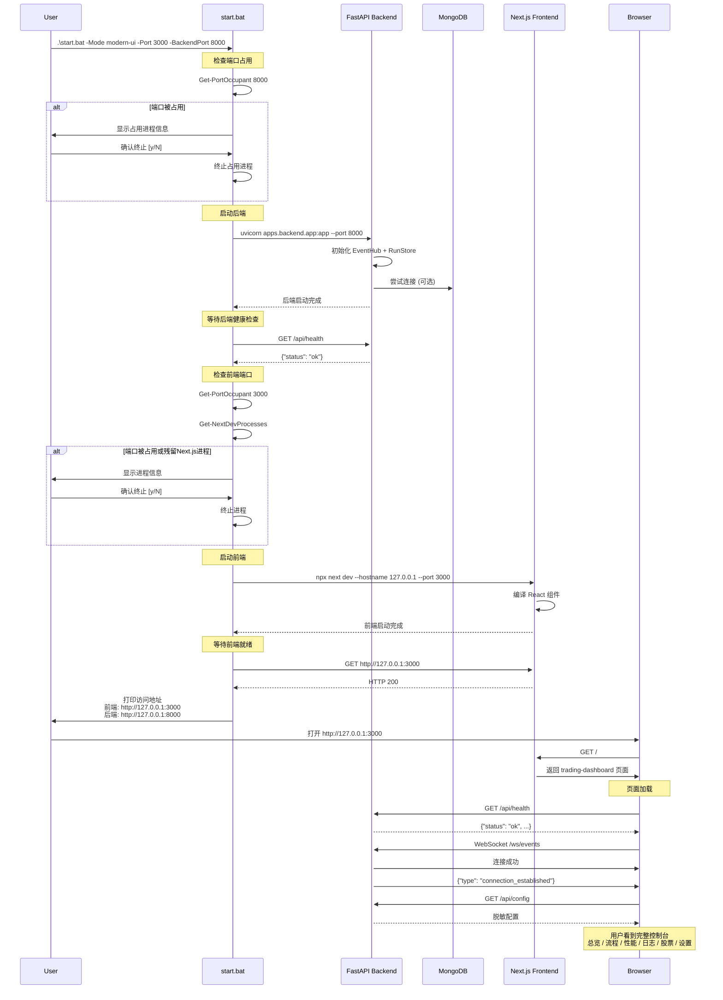
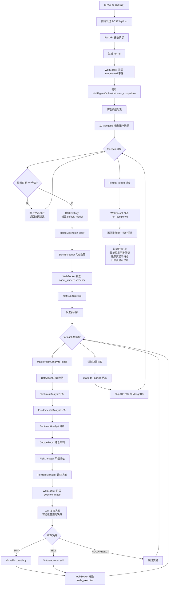
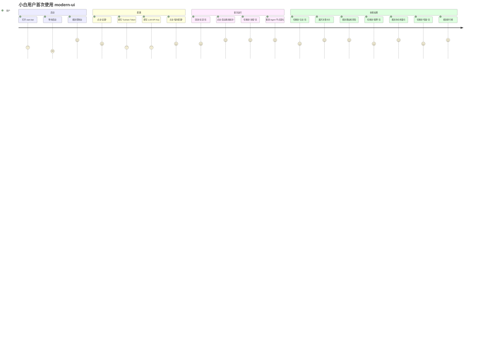
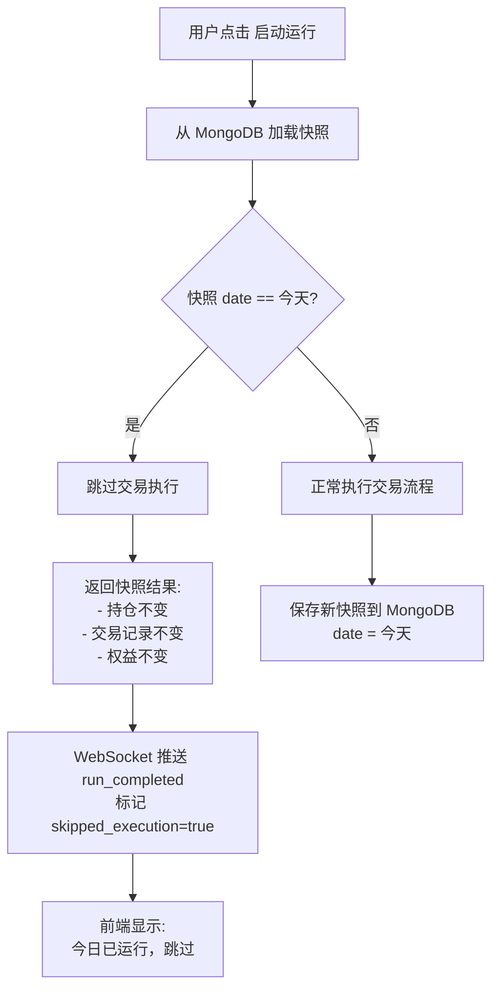

# 流程与时序文档

更新时间：2026-06-05

本文档面向核心开发者，描述系统从启动到交易的完整流程、用户视角 vs Agent视角对比。

---

## 1. modern-ui 启动流程

### 1.1 启动时序图



### 1.2 关键步骤说明

| 步骤 | 说明 | 如果失败怎么办 |
|------|------|---------------|
| **端口检查** | `Get-PortOccupant` 检查端口是否被占用 | 提示用户进程信息，确认后终止 |
| **后端启动** | `uvicorn apps.backend.app:app --port 8000` | 检查是否 8000 端口被其他服务占用 |
| **健康检查** | `GET /api/health` 最多等待 60 秒 | 如果超时，启动失败，检查后端日志 |
| **前端启动** | `npx next dev --hostname 127.0.0.1 --port 3000` | 检查 `node_modules` 是否完整，运行 `npm install` |
| **WebSocket连接** | 前端加载后自动连接 `/ws/events` | 前端显示"连接中"，30秒后超时重连 |

---

## 2. 自动投资轮次完整流程

### 2.1 完整流程图



### 2.2 关键阶段说明

#### 阶段 1：启动与恢复（5-10秒）

**职责**：
- 生成 `run_id`
- 从 MongoDB 恢复上次账户快照
- 检查幂等保护（同一交易日是否已运行）

**WebSocket 事件**：
```json
{"type": "run_started", "run_id": "...", "models": ["rule-baseline", "gpt-4o"]}
```

**用户看到**：
- 流程图页：所有节点变为 "pending" 状态
- 日志页：显示 "运行已启动" 事件

---

#### 阶段 2：动态选股（10-30秒）

**职责**：
- `StockScreener` 从 Tushare/AkShare 获取股票池
- 技术指标 + 基本面指标初筛
- 返回候选股列表 + 得分

**WebSocket 事件**：
```json
{"type": "agent_started", "agent_id": "screener"}
{"type": "agent_completed", "agent_id": "screener", "candidates_count": 5}
```

**用户看到**：
- 流程图页：`StockScreener` 节点变为 "running" → "completed"
- 股票页：候选股 tab 显示筛选出的股票

---

#### 阶段 3：深度分析（每只股票 5-15秒）

**职责**：
- `MasterAgent.analyze_stock` 对每只候选股进行 8 Agent 协作分析
- 依次调用：DataAgent → TechnicalAnalyst → FundamentalAnalyst → SentimentAnalyst → DebateRoom → RiskManager → PortfolioManager

**WebSocket 事件**：
```json
{"type": "agent_started", "agent_id": "technical_analyst", "stock_code": "600519"}
{"type": "agent_step", "agent_id": "technical_analyst", "stock_code": "600519", "signal": "BUY"}
{"type": "decision_made", "stock_code": "600519", "action": "BUY", "confidence": 0.75}
```

**用户看到**：
- 流程图页：各 Agent 节点依次变为 "running" → "completed"
- 日志页：实时显示决策卡片（折叠状态）
- 用户点击展开：显示详细理由、风险、评分

---

#### 阶段 4：LLM 复核（可选，3-10秒）

**职责**：
- 如果模型不是 `rule-baseline`，调用 LLM API 复核规则决策
- LLM 可能覆盖规则决策（例如规则说 BUY，LLM 说 REJECT）

**WebSocket 事件**：
```json
{"type": "llm_review", "stock_code": "600519", "original": "BUY", "llm_override": "HOLD"}
```

**用户看到**：
- 日志页：决策卡片显示 "LLM 复核" 标签
- 如果 LLM 覆盖了规则决策，显示差异

---

#### 阶段 5：交易执行（1-3秒）

**职责**：
- `VirtualAccount.buy` 或 `VirtualAccount.sell`
- 严格模拟 A 股规则：T+1、手续费、印花税、滑点
- 记录交易到 `trades` 列表

**WebSocket 事件**：
```json
{"type": "trade_executed", "stock_code": "600519", "side": "BUY", "shares": 200, "price": 1850.0}
```

**用户看到**：
- 股票页：持仓 tab 实时更新（新增持仓）
- 股票页：交易 tab 实时更新（新增交易记录）
- 日志页：决策卡片显示 "已执行" 状态

---

#### 阶段 6：止损检查 + 结算（1-2秒）

**职责**：
- 检查所有持仓是否触发止损（跌幅超过阈值）
- 强制卖出触发止损的持仓
- `mark_to_market` 结算当日权益

**WebSocket 事件**：
```json
{"type": "stop_loss_triggered", "stock_code": "600000", "reason": "跌幅超过 -8%"}
{"type": "trade_executed", "stock_code": "600000", "side": "SELL", "reason": "forced_stop_loss"}
```

**用户看到**：
- 股票页：持仓 tab 实时更新（减少或清空持仓）
- 日志页：显示止损事件

---

#### 阶段 7：排行榜生成（1秒）

**职责**：
- 按 `total_return` 排序所有模型账户
- 计算每个账户的：权益、收益率、最大回撤、胜率、交易次数

**WebSocket 事件**：
```json
{"type": "run_completed", "run_id": "...", "rankings": [...]}
```

**用户看到**：
- 性能页：排行榜 tab 显示最新排名
- 性能页：权益曲线更新（新增今日数据点）

---

## 3. 用户视角 vs Agent视角对比

### 3.1 对比表

| 维度 | 用户视角（modern-ui） | Agent视角（Python业务核心） |
|------|---------------------|------------------------|
| **启动入口** | 点击"启动运行"按钮 | `MultiAgentOrchestrator.run_competition()` |
| **选股过程** | 流程图显示 "StockScreener" 节点运行 | `StockScreener.screen()` 调用 DataAgent 获取股票池，技术+基本面初筛 |
| **分析过程** | 流程图显示 8 个 Agent 节点依次运行 | `MasterAgent.analyze_stock()` 依次调用 8 个 Agent |
| **决策展示** | 日志页显示折叠卡片：决策摘要 | `PortfolioManager.decide()` 返回 `DecisionReport` |
| **决策详情** | 用户点击展开：显示理由、风险、评分、动作 | `DecisionReport.to_dict()` 包含完整结构化数据 |
| **交易执行** | 股票页实时显示新持仓 + 新交易 | `VirtualAccount.buy()` / `sell()` 更新 `positions` 和 `trades` |
| **止损触发** | 日志页显示止损事件 + 强制卖出交易 | `MultiAgentOrchestrator._apply_forced_stop_loss()` 检查并执行 |
| **排行榜** | 性能页显示排名 + 权益曲线 | `MultiAgentOrchestrator` 按 `total_return` 排序并返回 |
| **幂等保护** | 用户再次点击"启动运行"，日志页显示"今日已运行，跳过" | `_is_same_trade_date_snapshot()` 检查快照日期，跳过交易执行 |

### 3.2 用户旅程示例

**场景**：小白用户第一次使用 modern-ui



---

## 4. WebSocket 实时事件协议

### 4.1 事件类型清单

| 事件类型 | 触发时机 | payload 内容 | 前端处理 |
|---------|---------|-------------|---------|
| `connection_established` | WebSocket 连接成功 | `event_types` 列表 | 更新连接状态为 "connected" |
| `run_started` | 用户点击"启动运行" | `run_id`, `models` | 流程图所有节点变为 "pending" |
| `agent_started` | Agent 开始执行 | `agent_id`, `stock_code` | 流程图对应节点变为 "running" |
| `agent_step` | Agent 执行中间步骤 | `agent_id`, `stock_code`, `signal` | 实时日志追加事件 |
| `agent_completed` | Agent 执行完成 | `agent_id`, `stock_code` | 流程图对应节点变为 "completed" |
| `decision_made` | PortfolioManager 做出决策 | `stock_code`, `action`, `confidence` | 日志页追加决策卡片 |
| `trade_executed` | VirtualAccount 执行交易 | `stock_code`, `side`, `shares`, `price` | 股票页更新持仓 + 交易记录 |
| `risk_checked` | RiskManager 风控评估完成 | `stock_code`, `risk_score`, `rejected` | 日志页显示风控结果 |
| `stop_loss_triggered` | 触发止损 | `stock_code`, `reason` | 日志页追加止损事件 |
| `config_updated` | 配置保存成功 | `timestamp` | 设置页显示"保存成功" |
| `run_completed` | 运行完成 | `run_id`, `rankings` | 性能页更新排行榜，流程图所有节点恢复 "idle" |
| `run_failed` | 运行失败 | `run_id`, `error` | 显示错误提示 |
| `error` | 任何错误 | `message`, `details` | 显示错误提示 |
| `pong` | 响应 ping 心跳 | `timestamp` | 保持连接活跃 |

### 4.2 事件示例

**决策事件**：
```json
{
  "type": "decision_made",
  "timestamp": "2026-06-05T15:30:00",
  "run_id": "run-20260605-1530",
  "agent_id": "portfolio_manager",
  "stock_code": "600519",
  "payload": {
    "action": "BUY",
    "confidence": 0.75,
    "position_size": 0.1,
    "reason": "技术面强势突破 + 基本面稳健 + 舆情积极",
    "risk_score": 0.3,
    "technical_signal": "BUY",
    "fundamental_score": 0.8,
    "sentiment_score": 0.7
  }
}
```

**交易事件**：
```json
{
  "type": "trade_executed",
  "timestamp": "2026-06-05T15:30:05",
  "run_id": "run-20260605-1530",
  "agent_id": "virtual_account",
  "stock_code": "600519",
  "payload": {
    "side": "BUY",
    "price": 1850.0,
    "shares": 200,
    "cash_after": 80000.0,
    "reason": "agent_buy"
  }
}
```

---

## 5. 幂等保护机制详解

### 5.1 为什么需要幂等保护

**问题**：
- 用户在同一交易日多次点击"启动运行"
- 如果不做保护，会重复买入同样的股票，导致仓位失控

**解决方案**：
1. 每次运行后，保存账户快照到 MongoDB，记录 `date` 字段
2. 下次运行前，检查快照的 `date` 是否等于当前 `trade_date`
3. 如果相等，跳过交易执行，直接返回快照结果

### 5.2 幂等保护流程



### 5.3 代码位置

```python
# src/astock_agent_system/orchestrator/multi_agent_orchestrator.py

def _is_same_trade_date_snapshot(snapshot: dict | None, trade_date: str) -> bool:
    """检查快照是否是同一交易日"""
    if not snapshot:
        return False
    return str(snapshot.get("date", "")).strip() == trade_date.strip()

def _run_one_agent(self, ..., previous_snapshot, trade_date) -> AgentCompetitionResult:
    # 幂等保护检查
    if _is_same_trade_date_snapshot(previous_snapshot, trade_date):
        return _result_from_existing_snapshot(...)  # 直接返回快照结果
    
    # 正常执行交易流程
    ...
```

---

## 6. 下一步阅读

- [系统架构](ARCHITECTURE.md) - 理解整体架构和 Agent 协作
- [设计决策](DESIGN_DECISIONS.md) - 理解为什么这么设计
- [同类项目对比](COMPARISON.md) - 和 FinRL、AutoGPT 对比
- [需求映射](USER_NEEDS_MAPPING.md) - 用户场景如何映射到代码
